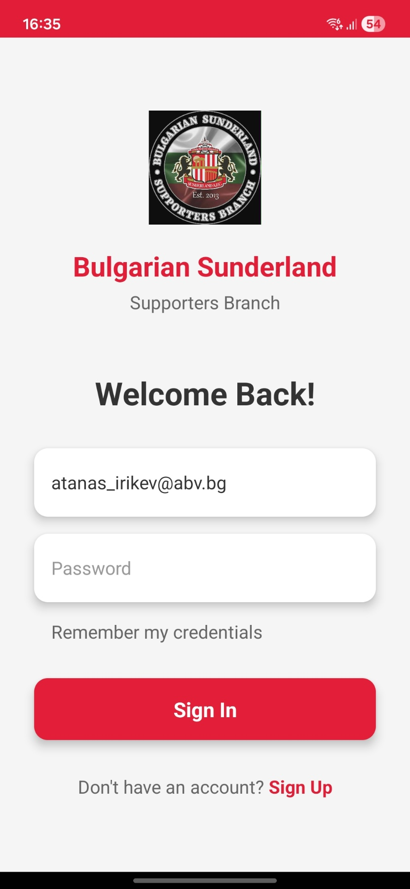
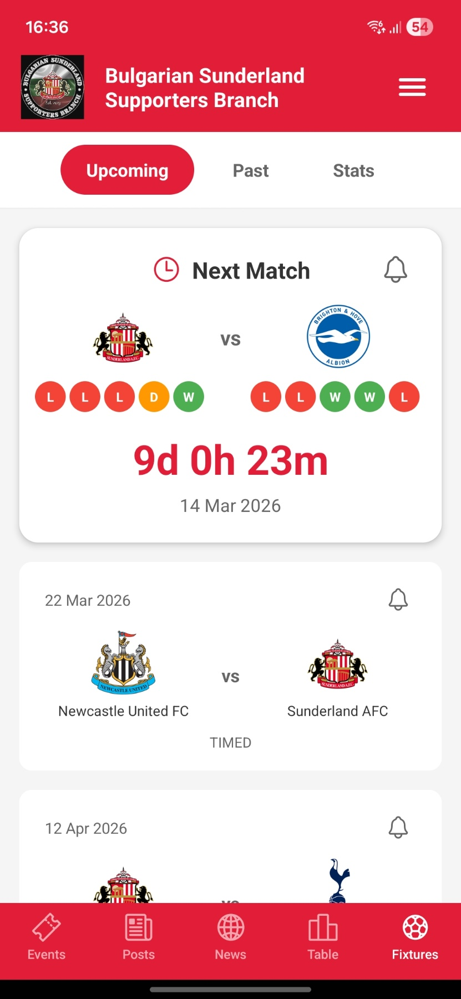
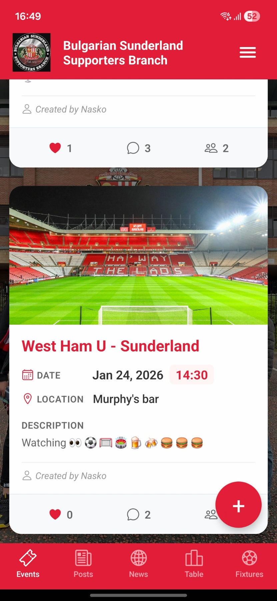
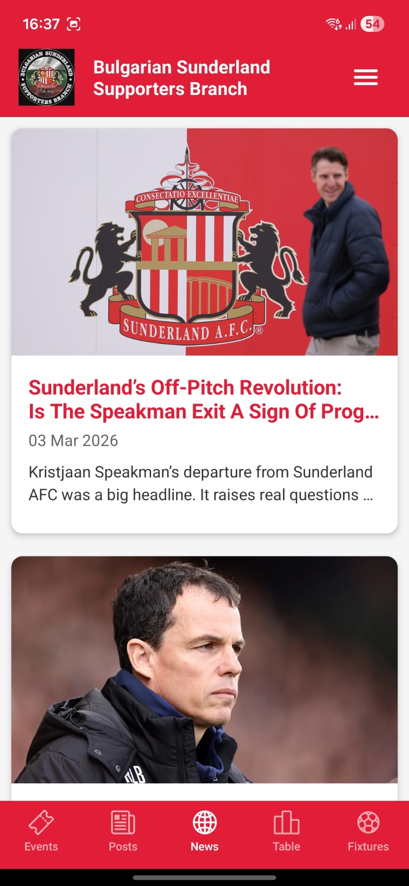
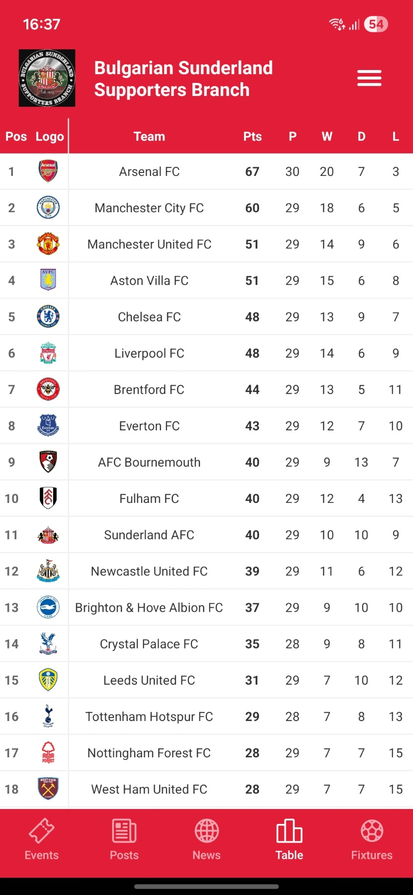
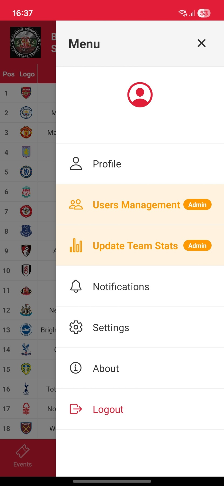

# BSSB - Bulgarian Sunderland Supporters Branch

A comprehensive mobile application for the Bulgarian Sunderland AFC supporters community, built with React Native and Expo. The app provides real-time match information, team statistics, social features, and community management tools.

## 📱 Features

### Core Features
- **Live Match Fixtures** - Real-time Sunderland AFC match schedules with scores and details
- **Team Statistics** - Comprehensive team performance metrics including:
  - Win/Draw/Loss records (Home & Away)
  - Goals scored and conceded
  - Clean sheets tracking
  - Top scorers and assists leaderboards
- **Match Reminders** - Push notifications for upcoming matches
- **League Table** - Current Championship standings

### Social Features
- **Community Events** - Create and manage supporter meetups and watch parties
- **Event Attendance** - RSVP system with attendee lists
- **Comments & Likes** - Engage with events and posts
- **News Feed** - Admin-curated posts for community updates
- **Real-time Updates** - Live comment threads and instant notifications

### User Management
- **User Authentication** - Secure Firebase authentication
- **Profile Management** - Customizable user profiles
- **Membership Tracking** - Paid membership status with admin controls
- **Admin Dashboard** - User management interface for administrators
- **Role-based Access** - Admin-only features for content moderation

### Admin Features
- **Users Management** - View and manage all registered users
- **Membership Control** - Mark users as paid/unpaid members
- **Team Stats Updates** - Manual update interface for player statistics
- **Content Moderation** - Create/delete posts and events
- **Admin Privileges** - Grant/revoke admin access

## 📸 Screenshots

<div align="center">
  
  
  
</div>

<div align="center">
  
  
  
</div>

## 🛠️ Tech Stack

### Frontend
- **React Native** - Cross-platform mobile development
- **Expo SDK 52** - Development framework and tooling
- **TypeScript** - Type-safe code
- **Expo Router** - File-based navigation
- **React Navigation** - Tab and stack navigation

### Backend & Services
- **Firebase Authentication** - User authentication and authorization
- **Cloud Firestore** - Real-time NoSQL database
- **Firebase Storage** - Image and media storage
- **Expo Notifications** - Local push notifications

### APIs & Data Sources
- **Football-Data.org API** - Live match data and fixtures
- **Cloudinary** - Image upload and optimization
- **Axios** - HTTP client for API requests

### State Management & Utilities
- **React Context API** - Global state management
- **AsyncStorage** - Local data persistence
- **date-fns** - Date formatting and manipulation

### UI/UX
- **React Native Components** - Native UI elements
- **Expo Vector Icons** - Icon library
- **Custom Styling** - StyleSheet-based theming
- **Modal Components** - Interactive overlays and forms

## 📂 Project Structure

```
bssb/
├── app/                          # Expo Router pages
│   ├── (auth)/                   # Authentication screens
│   │   ├── login.tsx
│   │   └── signup.tsx
│   ├── (tabs)/                   # Main tab navigation
│   │   ├── fixtures.tsx          # Match fixtures & stats
│   │   ├── news.tsx              # News feed
│   │   ├── posts.tsx             # Community posts
│   │   ├── table.tsx             # League table
│   │   └── profile.tsx           # User profile
│   ├── users.tsx                 # Admin user management
│   └── _layout.tsx               # Root layout
├── components/                   # Reusable components
│   ├── EventCard.tsx
│   ├── EventDetailsModal.tsx
│   ├── PostDetailsModal.tsx
│   ├── HamburgerMenu.tsx
│   └── NotificationSettings.tsx
├── contexts/                     # React Context providers
│   └── AuthContext.tsx
├── utils/                        # Utility functions & services
│   ├── eventService.ts           # Event CRUD operations
│   ├── postService.ts            # Post CRUD operations
│   ├── userService.ts            # User management
│   ├── statsService.ts           # Team statistics
│   └── notificationService.ts    # Push notifications
├── types/                        # TypeScript type definitions
│   ├── event.ts
│   └── post.ts
├── config/                       # Configuration files
│   ├── firebase.ts               # Firebase initialization
│   └── config.ts                 # API keys & settings
└── assets/                       # Images and static files

```

## 🔐 Security Features

- **Firestore Security Rules** - Role-based data access control
- **Admin-only Operations** - Protected routes and functions
- **Secure Authentication** - Firebase Auth with email/password
- **Data Validation** - Input sanitization and validation
- **Environment Variables** - Secure API key management

## 🚀 Key Implementations

### Real-time Data Synchronization
- Firestore real-time listeners for instant updates
- Optimistic UI updates for better UX
- Efficient data fetching with pagination

### Notification System
- Local push notifications for match reminders
- In-app notification badges
- Customizable notification preferences

### Admin Dashboard
- User search and filtering
- Bulk operations support
- Real-time user status updates
- Team statistics management interface

### Performance Optimizations
- Image optimization with Cloudinary
- Lazy loading for large lists
- Memoized callbacks and components
- Efficient re-render prevention

## 📊 Database Schema

### Collections
- **users** - User profiles and authentication data
- **events** - Community events and meetups
- **posts** - News and announcements
- **teamStats** - Player statistics (scorers, assists)
- **userSeenEvents** - Event view tracking

### Security Rules
- Users can read/write their own data
- Admins have elevated permissions
- Public read access for events and posts
- Protected write operations for sensitive data

## 🎨 Design Highlights

- **Sunderland AFC Branding** - Team colors (#e21d38 red)
- **Intuitive Navigation** - Bottom tab bar with clear icons
- **Responsive Layouts** - Adapts to different screen sizes
- **Loading States** - Skeleton screens and spinners
- **Error Handling** - User-friendly error messages
- **Accessibility** - Semantic HTML and ARIA labels

## 📱 Platform Support

- **Android** - Full native support with development builds
- **iOS** - Compatible (requires iOS configuration)
- **Expo Go** - Development testing support

## 🔄 Development Workflow

- **Expo Development Builds** - Fast iteration with hot reload
- **TypeScript** - Type safety and better IDE support
- **ESLint** - Code quality and consistency
- **Git Version Control** - Structured commit history

## 🌟 Future Enhancements

See [FUTURE_FEATURES.md](FUTURE_FEATURES.md) for planned features and improvements.

## 📄 License

This project is private and intended for the Bulgarian Sunderland Supporters Branch community.

## 👨‍💻 Developer

Built with ❤️ for the Sunderland AFC community

---

**Note**: This is a community-driven project for Sunderland AFC supporters in Bulgaria. All team data and branding belong to Sunderland Association Football Club.
